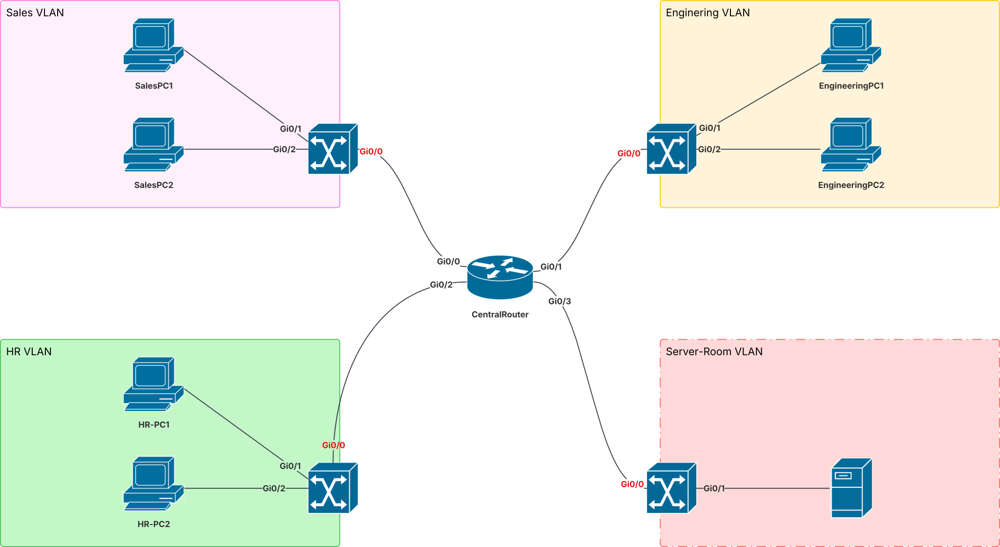

# Enterprise Network Topology

**Tools used:** GNS3, Cisco IOSv, VPCS **Skills demonstrated:** VLAN segmentation, 802.1Q trunking, router-on-a-stick inter-VLAN routing, extended ACLs, network documentation

---

## 1. Objective

Simulate the core network of a small company with multiple departments that need to be logically separated but still route traffic between each other in a controlled way — the kind of segmentatio[...]

**Requirements I set for this build:**

- Each department isolated on its own VLAN
- Centralized routing between all VLANs
- At least one access-control rule reflecting a real business rule (HR should not be able to reach Sales directly, but both need access to shared server resources)
- A documented, honest note on what I'd add for production-grade redundancy

---

## 2. Diagram



**Layout:** 1 core router (Cisco IOSv) in a star topology with 4 access switches — Sales, Engineering, HR, and Server-Room — each with end devices (VPCS) below them.

---

## 3. What I Built

### IP Addressing Plan

|VLAN|Department|Subnet|Gateway|
|---|---|---|---|
|10|Sales|10.10.10.0/24|10.10.10.1|
|20|Engineering|10.10.20.0/24|10.10.20.1|
|30|HR|10.10.30.0/24|10.10.30.1|
|40|Server-Room|10.10.40.0/24|10.10.40.1|

### Routing Design Decision

Used **router-on-a-stick** rather than SVIs on L3 switches, since the topology uses one physical router with a single link to each switch — one physical interface per switch, subdivided into VLA[...]

**OSPF was not used.** OSPF exchanges routes _between_ routers — with a single router terminating all VLAN subinterfaces, every subnet is already directly connected on that one device, so there'[...]

### Switch Configuration (per switch)

- VLAN created matching the department (10/20/30/40)
- End-device-facing ports set to access mode, assigned to that VLAN
- Uplink port to the router configured as an 802.1Q trunk

### Router Configuration

- 4 subinterfaces on the router's switch-facing interface, one per VLAN
- Each subinterface: `encapsulation dot1Q <vlan-id>` + gateway IP for that subnet

### Access Control List

**Business rule:** HR must not reach Sales directly. Both HR and Sales must still reach Server-Room.

```
ip access-list extended AC1
 deny ip 10.10.30.0 0.0.0.255 10.10.10.0 0.0.0.255
 permit ip any any
!
interface g0/2.30
 ip access-group AC1 in
```

Applied **inbound on HR's own subinterface (g0/2.30)** — this filters traffic right as it enters the router from HR, before routing decides where it goes, which is the correct place to enforce a[...]

**Verification performed:**

- HR → Sales: ping fails (blocked, as intended)
- HR → Server-Room: ping succeeds
- Sales ↔ Engineering: unaffected, confirming the ACL didn't over-block

---

## 4. Problems I Hit and How I Fixed Them

**ACL direction and destination mix-up.** My first draft of the ACL denied traffic from HR to Server-Room instead of HR to Sales — I had the destination subnet backwards. I also initially planne[...]

Working through it: to restrict where a subnet _can go_, the ACL needs to sit on that subnet's _own_ interface, filtering traffic _inbound_ — i.e., as it enters the router from that subnet, befo[...]

**Why this matters:** this is exactly the kind of mistake that's easy to make and easy to defend once understood — I'd rather show I caught and fixed it than pretend the first attempt was correc[...]

---

## 5. What I'd Do Differently at Scale

- **Redundancy:** This build uses a single router. In production, I'd add a second router and configure HSRP (or VRRP) across both, splitting switch uplinks between them, so a single router failur[...]
- **Routing protocol:** If this scaled to multiple sites or multiple routers, I'd introduce OSPF (single-area to start) to exchange routes between them, rather than relying on directly-connected s[...]
- **ACL scope:** The current ACL ends in a broad `permit ip any any`. At scale, I'd tighten this to explicitly permit only the traffic patterns the business actually needs, denying by default, rat[...]
- **L3 switches:** With more departments or more east-west traffic, I'd consider moving inter-VLAN routing onto L3 switches (SVIs) closer to the edge, rather than backhauling all inter-VLAN traffi[...]

---

## 6. Verification Output


**`show vlan brief`** 

```
SALES#show vlan brief

VLAN Name                             Status    Ports
---- -------------------------------- --------- -------------------------------
1    default                          active    Gi0/3, Gi1/0, Gi1/1, Gi1/2
                                                Gi1/3, Gi2/0, Gi2/1, Gi2/2
                                                Gi2/3, Gi3/0, Gi3/1, Gi3/2
                                                Gi3/3
10   sales                            active    Gi0/1, Gi0/2
1002 fddi-default                     act/unsup
1003 token-ring-default               act/unsup
1004 fddinet-default                  act/unsup
1005 trnet-default                    act/unsup
SALES#
############################################################################
ENGINEERING#show vlan brief

VLAN Name                             Status    Ports
---- -------------------------------- --------- -------------------------------
1    default                          active    Gi0/3, Gi1/0, Gi1/1, Gi1/2
                                                Gi1/3, Gi2/0, Gi2/1, Gi2/2
                                                Gi2/3, Gi3/0, Gi3/1, Gi3/2
                                                Gi3/3
20   Engineering                      active    Gi0/1, Gi0/2
1002 fddi-default                     act/unsup
1003 token-ring-default               act/unsup
1004 fddinet-default                  act/unsup
1005 trnet-default                    act/unsup
ENGINEERING#
###########################################################################
HR#show vlan brief

VLAN Name                             Status    Ports
---- -------------------------------- --------- -------------------------------
1    default                          active    Gi0/3, Gi1/0, Gi1/1, Gi1/2
                                                Gi1/3, Gi2/0, Gi2/1, Gi2/2
                                                Gi2/3, Gi3/0, Gi3/1, Gi3/2
                                                Gi3/3
30   HR                               active    Gi0/1, Gi0/2
1002 fddi-default                     act/unsup
1003 token-ring-default               act/unsup
1004 fddinet-default                  act/unsup
1005 trnet-default                    act/unsup
HR#
############################################################################
ServerRoom#show vlan brief

VLAN Name                             Status    Ports
---- -------------------------------- --------- -------------------------------
1    default                          active    Gi0/2, Gi0/3, Gi1/0, Gi1/1
                                                Gi1/2, Gi1/3, Gi2/0, Gi2/1
                                                Gi2/2, Gi2/3, Gi3/0, Gi3/1
                                                Gi3/2, Gi3/3
40   ServerRoom                       active    Gi0/1
1002 fddi-default                     act/unsup
1003 token-ring-default               act/unsup
1004 fddinet-default                  act/unsup
1005 trnet-default                    act/unsup
ServerRoom#

```

**`show ip interface brief`** (router):

```
CentralRouter#show ip interface brief
Interface                  IP-Address      OK? Method Status                Protocol
GigabitEthernet0/0         unassigned      YES unset  up                    up
GigabitEthernet0/0.10      10.10.10.1      YES manual up                    up
GigabitEthernet0/1         unassigned      YES unset  up                    up
GigabitEthernet0/1.20      10.10.20.1      YES manual up                    up
GigabitEthernet0/2         unassigned      YES unset  up                    up
GigabitEthernet0/2.30      10.10.30.1      YES manual up                    up
GigabitEthernet0/3         unassigned      YES unset  up                    up
GigabitEthernet0/3.40      10.10.40.1      YES manual up                    up
CentralRouter#

```

**`show access-lists AC1`** :

```
CentralRouter#show access-lists AC1
Extended IP access list AC1
    10 deny ip 10.10.30.0 0.0.0.255 10.10.10.0 0.0.0.255 (4 matches)
    20 permit ip any any (10 matches)
CentralRouter#

```

---

## Setup / How to Reproduce

1. Open in GNS3 (project file included in this repo).
2. Start all nodes, wait for the router and switches to fully boot.
3. Router and switch configs are in the `configs/` folder — apply via console or paste directly.
4. VPCS IPs are set per the addressing table above (`ip <address> <mask> <gateway>` on each VPCS node).
5. Verify with the ping tests described in section 3.
